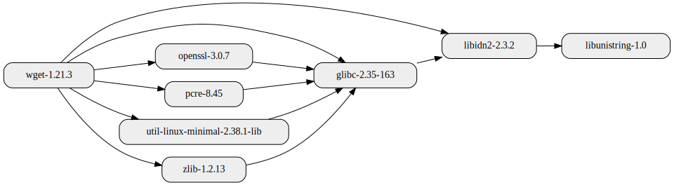

<!--
SPDX-FileCopyrightText: 2022-2023 Technology Innovation Institute (TII)

SPDX-License-Identifier: Apache-2.0
-->

# sbomnix

`sbomnix` is a utility that generates SBOMs given [nix](https://nixos.org/) derivations or out paths.

In addition to `sbomnix` this repository is a home to [nixgraph](./doc/nixgraph.md), a python library and command line utility for querying and visualizing dependency graphs for [nix](https://nixos.org/) packages.

For a demonstration of how to use `sbomnix` generated SBOM in automating vulnerability scans see: [vulnxscan](scripts/vulnxscan/README.md#example-automating-nix-vulnerability-scans).

`sbomnix` and other tools in this repository originate from the [Ghaf](https://github.com/tiiuae/ghaf) project.

Table of Contents
=================

* [Getting Started](#getting-started)
   * [Running without installation](#running-without-installation)
   * [Installation](#installation)
* [Usage examples](#usage-examples)
   * [Generate SBOM based on derivation file or out-path](#generate-sbom-based-on-derivation-file-or-out-path)
   * [Generate SBOM including meta information](#generate-sbom-including-meta-information)
   * [Generate SBOM including buildtime dependencies](#generate-sbom-including-buildtime-dependencies)
   * [Generate SBOM based on result symlink](#generate-sbom-based-on-result-symlink)
   * [Visualize package dependencies](#visualize-package-dependencies)
* [Contribute](#contribute)
* [License](#license)
* [Acknowledgements](#acknowledgements)

## Getting Started
`sbomnix` requires common [nix](https://nixos.org/download.html) tools like `nix` and `nix-store`. These tools are expected to be in `$PATH`.
`nixgraph` requires [graphviz](https://graphviz.org/download/).

### Running without installation
#### Running as nix flake
`sbomnix` can be run as a nix flake from the `tiiuae/sbomnix` repository:
```bash
$ nix run github:tiiuae/sbomnix#sbomnix
```

or from a locally cloned repository:
```bash
$ git clone https://github.com/tiiuae/sbomnix
$ cd sbomnix
$ nix run .#sbomnix
```
Similarly, you can run `nixgraph` with `nix run github:tiiuae/sbomnix#nixgraph`.
See the list of other supported flake targets with: `nix flake show`.

#### Running as python script
Running `sbomnix` as python script requires python3 and packages specified in [requirements.txt](./requirements.txt). You can install the required packages with:
```bash
$ git clone https://github.com/tiiuae/sbomnix
$ cd sbomnix
$ pip3 install --user -r requirements.txt
```
After requirements have been installed, you can run sbomnix without installation as follows:
```bash
$ source scripts/env.sh
$ python3 sbomnix/main.py
usage: main.py [-h] [--version] [--verbose VERBOSE] [--meta [META]] [--type {runtime,buildtime,both}] [--csv [CSV]] [--cdx [CDX]] NIX_PATH
```

### Installation
Examples in this README.md assume you have installed `sbomnix` on your system and that command `sbomnix` is in `$PATH`. To install `sbomnix` from source, run:
```bash
$ git clone https://github.com/tiiuae/sbomnix
$ cd sbomnix
$ make install
```

## Usage examples
In the below examples, we use nix package `wget` as an example target.
To install wget and print out its out-path on your local system, try something like:
```bash
$ nix-shell -p wget --run exit && nix eval -f '<nixpkgs>' 'wget.outPath'
"/nix/store/8nbv1drmvh588pwiwsxa47iprzlgwx6j-wget-1.21.3"
```

#### Generate SBOM based on derivation file or out-path
By default `sbomnix` scans the given target and generates an SBOM including the runtime dependencies:
```bash
$ sbomnix /nix/store/8nbv1drmvh588pwiwsxa47iprzlgwx6j-wget-1.21.3
...
INFO     Wrote: sbom.cdx.json
INFO     Wrote: sbom.csv
```
Main output is the SBOM json file (sbom.cdx.json) in [CycloneDX](https://cyclonedx.org/) format.

#### Generate SBOM including meta information
To include license information to the SBOM, first generate package meta information with `nix-env`:
```bash
$ nix-env -qa --meta --json '.*' >meta.json
```
Then, run `sbomnix` with `--meta` argument to tell sbomnix to read meta information from the given json file:
```bash
$ sbomnix /nix/store/8nbv1drmvh588pwiwsxa47iprzlgwx6j-wget-1.21.3 --meta meta.json
```

#### Generate SBOM including buildtime dependencies
By default `sbomnix` scans the given target for runtime dependencies. You can tell sbomnix to include buildtime dependencies using the `--type` argument. 
Acceptable values for `--type` are `runtime, buildtime, both`. Below example generates SBOM including buildtime-only dependencies:
```bash
$ sbomnix /nix/store/8nbv1drmvh588pwiwsxa47iprzlgwx6j-wget-1.21.3 --meta meta.json --type=buildtime
```
#### Generate SBOM based on result symlink
`sbomnix` can be used with output paths too (e.g. anything which produces a result symlink):
```bash
$ sbomnix /path/to/result 
```
#### Visualize package dependencies
`sbomnix` finds the package dependencies using `nixgraph`. 
Moreover, `nixgraph` can also be used as a stand-alone tool for visualizing package dependencies.
Below, we show an example of visualizing package `wget` runtime dependencies:
```bash
$ nixgraph /nix/store/8nbv1drmvh588pwiwsxa47iprzlgwx6j-wget-1.21.3 --depth=2
```

Which outputs the dependency graph as an image (with maxdepth 2):



For more examples on querying and visualizing the package dependencies, see: [nixgraph](./doc/nixgraph.md).

## Contribute
Any pull requests, suggestions, and error reports are welcome.
To start development, we recommend using nix flakes devShell:
```bash
$ git clone https://github.com/tiiuae/sbomnix
$ cd sbomnix/
$ nix develop
```
Run `make help` to see the list of other make targets.
Prior to sending any pull requests, make sure at least the `make pre-push` runs without failures.

To deactivate the nix devshell, run `exit` in your shell.
To see other nix flake targets, run `nix flake show`.


## License
This project is licensed under the Apache-2.0 license - see the [Apache-2.0.txt](LICENSES/Apache-2.0.txt) file for details.


## Acknowledgements
`sbomnix` uses nix store derivation scanner ([nix.py](sbomnix/nix.py) and [derivation.py](sbomnix/derivation.py)) originally from [vulnix](https://github.com/flyingcircusio/vulnix).
