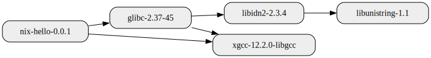
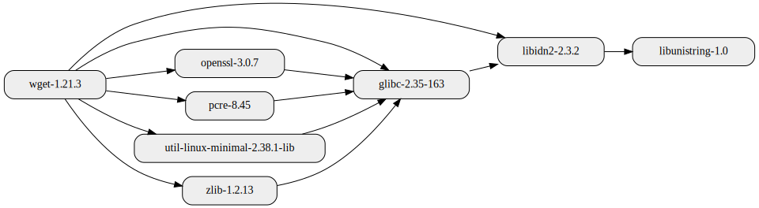

<!--
SPDX-FileCopyrightText: 2022-2023 Technology Innovation Institute (TII)

SPDX-License-Identifier: CC-BY-SA-4.0
-->

# sbomnix

This repository is home to various command line tools and Python libraries that aim to help with software supply chain challenges:
- [`sbomnix`](#generate-sbom) is a utility that generates SBOMs given a [Nix](https://nixos.org/) flake reference or store path.
- [`nixgraph`](./doc/nixgraph.md) helps query and visualize dependency graphs for [Nix](https://nixos.org/) packages.
- [`nixmeta`](./doc/nixmeta.md) summarizes nixpkgs meta-attributes from the given nixpkgs version.
- [`vulnxscan`](./doc/vulnxscan.md) is a vulnerability scanner demonstrating the usage of SBOMs in running vulnerability scans.
- [`repology_cli`](./doc/repology_cli.md) and [`repology_cve`](./doc/repology_cli.md#repology-cve-search) are command line clients to [repology.org](https://repology.org/).
- [`nix_outdated`](./doc/nix_outdated.md) is a utility that finds outdated nix dependencies for given out path, listing the outdated packages in priority order based on how many other packages depend on the given outdated package.
- [`provenance`](./doc/provenance.md) is a command line tool to generate SLSA v1.0 compliant [provenance](https://slsa.dev/spec/v1.0/provenance) attestation files in json format for any nix flake or derivation.

For an example of how to use the tooling provided in this repository to automate daily vulnerability scans for a nix flake project, see: [ghafscan](https://github.com/tiiuae/ghafscan).

The [CycloneDX](https://cyclonedx.org/) and [SPDX](https://spdx.github.io/spdx-spec/v2.3/) SBOMs for each release of sbomnix tooling is available in the [release assets](https://github.com/tiiuae/sbomnix/releases/latest).

All the tools in this repository originate from [Ghaf Framework](https://github.com/tiiuae/ghaf).

Table of Contents
=================

* [Getting Started](#getting-started)
   * [Running as Nix Flake](#running-as-nix-flake)
   * [Running from Nix Development Shell](#running-from-nix-development-shell)
* [Buildtime vs Runtime Dependencies](#buildtime-vs-runtime-dependencies)
   * [Buildtime Dependencies](#buildtime-dependencies)
   * [Runtime Dependencies](#runtime-dependencies)
* [Usage Examples](#usage-examples)
   * [Generate SBOM Based on Flake Reference](#generate-sbom-based-on-flake-reference)
   * [Generate SBOM Based on Derivation File or Out-path](#generate-sbom-based-on-derivation-file-or-out-path)
   * [Generate SBOM Including Buildtime Dependencies](#generate-sbom-including-buildtime-dependencies)
   * [Generate SBOM Based on a Store Path or Result Symlink](#generate-sbom-based-on-a-store-path-or-result-symlink)
   * [Nixpkgs Metadata Source Selection](#nixpkgs-metadata-source-selection)
   * [Visualize Package Dependencies](#visualize-package-dependencies)
* [Contribute](#contribute)
* [License](#license)
* [Acknowledgements](#acknowledgements)

## Getting Started
`sbomnix` requires the [Nix](https://nixos.org/download.html) command line
tool to be in `$PATH`. Direct, non-flake usage requires a modern `nix`
supporting `nix-command` and `--json-format 1`.

### Running as Nix Flake
`sbomnix` can be run as a [Nix flake](https://nixos.wiki/wiki/Flakes) from the `tiiuae/sbomnix` repository:
```bash
# '--' signifies the end of argument list for `nix`.
# '--help' is the first argument to `sbomnix`
$ nix run github:tiiuae/sbomnix#sbomnix -- --help
```

or from a local repository:
```bash
$ git clone https://github.com/tiiuae/sbomnix
$ cd sbomnix
$ nix run .#sbomnix -- --help
```
See the full list of supported flake targets by running `nix flake show`.

### Running from Nix Development Shell

If you have nix flakes [enabled](https://nixos.wiki/wiki/Flakes#Enable_flakes), start a development shell:
```bash
$ git clone https://github.com/tiiuae/sbomnix
$ cd sbomnix
$ nix develop
```

The devshell adds all CLI entry points (`sbomnix`, `nixgraph`, `nixmeta`, `vulnxscan`, `repology_cli`, `repology_cve`, `nix_outdated`, `provenance`) to `PATH`. They run against the local source tree, so any edits are picked up immediately without reinstalling.

All tools support a consistent verbosity flag: no flag or `--verbose=0`
shows INFO output, `-v` or `--verbose=1` enables VERBOSE progress
details, `-vv` or `--verbose=2` enables DEBUG details, and `-vvv` or
`--verbose=3` enables SPAM output. Repeated short flags are counted, so
`-v -v`, `-vv`, and `--verbose=2` are equivalent.

## Buildtime vs Runtime Dependencies
#### Buildtime Dependencies
The buildtime dependencies of a Nix package are the [closure](https://nixos.org/manual/nix/stable/glossary.html#gloss-closure) of its derivation (`.drv` file): all the store paths Nix must have available to reproduce the build, including compilers, build tools, standard libraries, and the infrastructure to bootstrap them. Even a simple hello-world C program typically pulls in over 150 packages, including gcc, stdenv, glibc, and bash. Computing the buildtime dependency closure only requires evaluating the derivation; the target does not need to be built.

For reference, below is a graph of the first two layers of buildtime dependencies of an example hello-world C program (direct dependencies and the first level of transitive dependencies): [C hello-world buildtime, depth=2](doc/img/c_hello_world_buildtime_d2.svg).

#### Runtime Dependencies
[Runtime dependencies](https://nixos.org/manual/nix/stable/command-ref/new-cli/nix3-why-depends.html#description) are a subset of buildtime dependencies. When Nix builds a package, it scans the build outputs for references to other store paths and records them. The runtime closure is the transitive set of those recorded references: the store paths the built output actually needs at runtime. Because this information is captured during the build, the target must be built before its runtime dependencies can be determined. For reference, below is the complete runtime dependency graph of the same hello-world C program:



By default, the tools in this repository work with runtime dependencies. Specifically, unless told otherwise, `sbomnix` generates an SBOM of runtime dependencies, `nixgraph` graphs runtime dependencies, and `vulnxscan` and `nix_outdated` scan runtime dependencies. Since the target must be built to determine runtime dependencies, all these tools will build (force-realise) the target as part of their invocation. All tools also accept a `--buildtime` argument to work with buildtime dependencies instead; as noted above, using `--buildtime` does not require building the target.


## Usage Examples
In the below examples, we use Nix package `wget` as an example target, referred to by flakeref `github:NixOS/nixpkgs/nixos-unstable#wget`.

#### Generate SBOM Based on Flake Reference
`sbomnix` accepts [flake references](https://nixos.org/manual/nix/stable/command-ref/new-cli/nix3-flake.html#flake-references) as targets:
```bash
$ sbomnix github:NixOS/nixpkgs?ref=nixos-unstable#wget
```

#### Generate SBOM Based on Derivation File or Out-path
Flake references are the recommended target for `sbomnix`. When the target is a flake reference, `sbomnix` can resolve the nixpkgs version used to build the package and enrich the SBOM with metadata such as descriptions, licenses, maintainers, and homepage links. When the target is a store path, there is no information about which nixpkgs version produced it, so metadata enrichment is skipped by default; see [Nixpkgs Metadata Source Selection](#nixpkgs-metadata-source-selection).

By default `sbomnix` scans the given target and generates an SBOM including the runtime dependencies.
Notice: determining the target runtime dependencies in Nix requires building the target.
```bash
# Target can be specified as a flakeref or a nix store path, e.g.:
# sbomnix .
# sbomnix github:tiiuae/sbomnix
# sbomnix nixpkgs#wget
# sbomnix /nix/store/...  (note: nixpkgs metadata not available for store path targets)
# Ref: https://nixos.org/manual/nix/stable/command-ref/new-cli/nix3-flake.html#flake-references
$ sbomnix github:NixOS/nixpkgs/nixos-unstable#wget
...
INFO     Wrote: sbom.cdx.json
INFO     Wrote: sbom.spdx.json
INFO     Wrote: sbom.csv
```
Main outputs are the SBOM json files sbom.cdx.json and sbom.spdx.json in [CycloneDX](https://cyclonedx.org/) and [SPDX](https://spdx.github.io/spdx-spec/v2.3/) formats.

#### Generate SBOM Including Buildtime Dependencies
By default `sbomnix` scans the given target for runtime dependencies. You can tell sbomnix to determine the buildtime dependencies using the `--buildtime` argument.
Below example generates SBOM including buildtime dependencies.
Notice: as opposed to runtime dependencies, determining the buildtime dependencies does not require building the target.
```bash
$ sbomnix github:NixOS/nixpkgs/nixos-unstable#wget --buildtime
```

#### Generate SBOM Based on a Store Path or Result Symlink
`sbomnix` accepts Nix store paths and result symlinks as targets:
```bash
$ sbomnix /path/to/result
```
Note: store paths carry no record of which nixpkgs version produced them, so nixpkgs metadata enrichment is skipped by default. Pass `--meta-nixpkgs` to supply a nixpkgs source explicitly, or see [Nixpkgs Metadata Source Selection](#nixpkgs-metadata-source-selection).

#### Nixpkgs Metadata Source Selection
`sbomnix` enriches packages with nixpkgs metadata, such as descriptions,
licenses, maintainers, and homepage links, when it can select a nixpkgs
source that is tied to the target.

For flakeref targets, `sbomnix` uses the target flake context. NixOS
toplevel flakerefs are handled through the selected NixOS package set, so
overlays, package overrides, nixpkgs config, and system-specific package-set
changes can be represented.

Store-path targets skip nixpkgs metadata by default; pass `--meta-nixpkgs` to
choose the source explicitly.

`--meta-nixpkgs <flakeref-or-path>` scans an explicit nixpkgs source.
`--meta-nixpkgs nix-path` scans the `nixpkgs=` entry from `NIX_PATH` as an
explicit opt-in source. `--exclude-meta` disables this enrichment and cannot be
combined with `--meta-nixpkgs`.

CycloneDX and SPDX outputs record the selected metadata source in document
metadata, including fields such as `nixpkgs:metadata_source_method`,
`nixpkgs:path`, `nixpkgs:rev`, `nixpkgs:flakeref`, `nixpkgs:version`, and
`nixpkgs:message`.

#### Visualize Package Dependencies
`sbomnix` uses structured Nix JSON to find package dependencies where
available. `nixgraph` can also be used as a stand-alone tool for visualizing
package dependencies.
Below, we show an example of visualizing package `wget` runtime dependencies:
```bash
$ nixgraph github:NixOS/nixpkgs/nixos-unstable#wget --depth=2
```

Which outputs the dependency graph as an image (with maxdepth 2):



For more examples on querying and visualizing the package dependencies, see: [nixgraph](./doc/nixgraph.md).

## Contribute
Any pull requests, questions and error reports are welcome.
To start development, we recommend using Nix flakes development shell:
```bash
$ git clone https://github.com/tiiuae/sbomnix
$ cd sbomnix/
$ nix develop
```
Before opening a pull request, run at minimum:
```bash
$ ./scripts/check-fast.sh
```
This runs the formatter, a fast flake eval, and the fast test lane.
CI runs `./scripts/check-full.sh`, which validates the flake and runs the full
test lane with coverage.

To deactivate the Nix devshell, run `exit` in your shell.
To see other Nix flake targets, run `nix flake show`.


## License
This project is licensed under the Apache-2.0 license - see the [Apache-2.0.txt](LICENSES/Apache-2.0.txt) file for details.


## Acknowledgements
Parts of the Nix store derivation loading code in `sbomnix`
([derivation.py](src/sbomnix/derivation.py) and
[derivers.py](src/sbomnix/derivers.py)) originate from
[vulnix](https://github.com/nix-community/vulnix).
