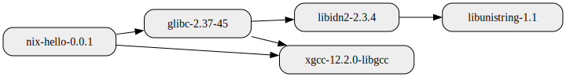

<!--
SPDX-FileCopyrightText: 2022-2023 Technology Innovation Institute (TII)

SPDX-License-Identifier: CC-BY-SA-4.0
-->

# sbomnix

This repository is home to various command line tools and Python libraries that aim to help with software supply chain challenges:
- [`sbomnix`](#generate-sbom-based-on-derivation-file-or-out-path) is a utility that generates SBOMs given [Nix](https://nixos.org/) derivation or out path.
- [`nixgraph`](./doc/nixgraph.md) helps query and visualize dependency graphs for [Nix](https://nixos.org/) derivation or out path.
- [`nixmeta`](./doc/nixmeta.md) summarizes nixpkgs meta-attributes from the given nixpkgs version.
- [`vulnxscan`](./doc/vulnxscan.md) is a vulnerability scanner demonstrating the usage of SBOMs in running vulnerability scans.
- [`repology_cli`](./doc/replogoy_cli.md) and [`repology_cve`](./doc/replogoy_cli.md#repology-cve-search) are command line clients to [repology.org](https://repology.org/).
- [`nix_outdated`](./doc/nix_outdated.md) is a utility that finds outdated nix dependencies for given out path, listing the outdated packages in priority order based on how many other packages depend on the given outdated package.

For an example of how to use the tooling provided in this repository to automate daily vulnerability scans for a nix flake project, see: [ghafscan](https://github.com/tiiuae/ghafscan).

The [CycloneDX](https://cyclonedx.org/) and [SPDX](https://spdx.github.io/spdx-spec/v2.3/) SBOMs for each release of sbomnix tooling is available in the [release assets](https://github.com/tiiuae/sbomnix/releases/latest).

All the tools in this repository originate from [Ghaf Framework](https://github.com/tiiuae/ghaf).

Table of Contents
=================

* [Getting Started](#getting-started)
   * [Running as Nix Flake](#running-as-nix-flake)
   * [Running from Nix Development Shell](#running-from-nix-development-shell)
* [Buildtime vs Runtime Dependencies](#buildtime-vs-runtime-dependencies)
   * [Buildtime Dependencies](#buildtime-dependencies)
   * [Runtime Dependencies](#runtime-dependencies)
* [Usage Examples](#usage-examples)
   * [Generate SBOM Based on Derivation File or Out-path](#generate-sbom-based-on-derivation-file-or-out-path)
   * [Generate SBOM Including Meta Information](#generate-sbom-including-meta-information)
   * [Generate SBOM Including Buildtime Dependencies](#generate-sbom-including-buildtime-dependencies)
   * [Generate SBOM Based on Result Symlink](#generate-sbom-based-on-result-symlink)
   * [Generate SBOM Based on Flake Reference](#generate-sbom-based-on-flake-reference)
   * [Visualize Package Dependencies](#visualize-package-dependencies)
* [Contribute](#contribute)
* [License](#license)
* [Acknowledgements](#acknowledgements)

## Getting Started
`sbomnix` requires common [Nix](https://nixos.org/download.html) tools like `nix` and `nix-store`. These tools are expected to be in `$PATH`.

### Running as Nix Flake
`sbomnix` can be run as a [Nix flake](https://nixos.wiki/wiki/Flakes) from the `tiiuae/sbomnix` repository:
```bash
# '--' signifies the end of argument list for `nix`.
# '--help' is the first argument to `sbomnix`
$ nix run github:tiiuae/sbomnix#sbomnix -- --help
```

or from a local repository:
```bash
$ git clone https://github.com/tiiuae/sbomnix
$ cd sbomnix
$ nix run .#sbomnix -- --help
```
See the full list of supported flake targets by running `nix flake show`.

### Running from Nix Development Shell

If you have nix flakes [enabled](https://nixos.wiki/wiki/Flakes#Enable_flakes), start a development shell:
```bash
$ git clone https://github.com/tiiuae/sbomnix
$ cd sbomnix
$ nix develop
```

You can also use `nix-shell` to enter the development shell:
```bash
$ git clone https://github.com/tiiuae/sbomnix
$ cd sbomnix
$ nix-shell
```

Keep in mind this doesn't add the various entrypoint binaries to your `PATH`
directly. They are produced during the setuptools build.

While you're in the devshell, you can run various command line tools via the entrypoint files
directly:

```bash
# sbomnix:
$ src/sbomnix/main.py --help

# nixgraph:
$ src/nixgraph/main.py --help

# nixmeta:
$ src/nixmeta/main.py --help

# vulnxscan:
$ src/vulnxscan/vulnxscan_cli.py --help

# repology_cli:
$ src/repology/repology_cli.py --help

# repology_cve:
$ src/repology/repology_cve.py --help

# nix_outdated:
$ src/nixupdate/nix_outdated.py --help
```

## Buildtime vs Runtime Dependencies
#### Buildtime Dependencies
[Closure](https://nixos.org/manual/nix/stable/glossary.html#gloss-closure) of a nix store path is a list of all the dependent store paths, recursively, referenced by the target store path. For a package, the closure of it's derivation lists all the buildtime dependencies. As an example, for a simple C program, the buildtime dependencies include packages to bootstrap gcc, stdenv, glibc, bash, etc. on the target architecture. Even a simple hello-world C program typically includes over 150 packages in its list of buildtime dependencies. It's important to note that generating buildtime dependencies in Nix does not require building the target.

For reference, following is a link to graph from an example hello-world C program that includes the first two layers of buildtime dependencies: direct dependencies and the first level of transitive dependencies: [C hello-world buildtime, depth=2](doc/img/c_hello_world_buildtime_d2.svg).

#### Runtime Dependencies
[Runtime dependencies](https://nixos.org/manual/nix/stable/command-ref/new-cli/nix3-why-depends.html#description) are a subset of buildtime dependencies. Nix automatically determines the runtime dependencies by scanning the generated output paths (i.e. build output) for the buildtime dependencies' store paths. This means nix needs to build the target output first, before runtime dependencies can be determined. For reference, below is a complete runtime dependency graph of an example hello-world C program:




By default, where applicable, the tools in this repository assume runtime dependencies. This means, for instance, that unless specified otherwise, `sbomnix` will output an SBOM including runtime-only dependencies, `nixgraph` outputs runtime dependency graph, and `vulnxscan` and `nix_outdated` scan runtime dependencies. Since Nix needs to build the target output to determine the runtime dependencies, all the tools in this repository will also build (force-realise) the target output as part of each tool's invocation when determining the runtime dependencies. All the mentioned tools in this repository also support working with buildtime dependencies instead of runtime dependencies with the help of `--buildtime` command line argument. As mentioned earlier, generating buildtime dependencies in Nix does not require building the target. Similarly, when `--buildtime` is specified, the tools in this repository do not need to be build the given target.


## Usage Examples
The usage examples work for both the built package, as well as inside the devshell.

Keep in mind inside the devshell, calls to `sbomnix` need to be replaced with
`src/sbomnix/main.py` (and similar for other entrypoints).

In the below examples, we use Nix package `wget` as an example target.
To print `wget` out-path on your local system, try:
```bash
$ nix eval -f '<nixpkgs>' 'wget.outPath'
"/nix/store/8nbv1drmvh588pwiwsxa47iprzlgwx6j-wget-1.21.3"
```

#### Generate SBOM Based on Derivation File or Out-path
By default `sbomnix` scans the given target and generates an SBOM including the runtime dependencies.
Notice: determining the target runtime dependencies in Nix requires building the target.
```bash
# Target can be specified with flakeref too, e.g.:
# sbomnix .
# sbomnix github:tiiuae/sbomnix
# sbomnix nixpkgs#wget
# Ref: https://nixos.org/manual/nix/stable/command-ref/new-cli/nix3-flake.html#flake-references
$ sbomnix /nix/store/8nbv1drmvh588pwiwsxa47iprzlgwx6j-wget-1.21.3
...
INFO     Wrote: sbom.cdx.json
INFO     Wrote: sbom.spdx.json
INFO     Wrote: sbom.csv
```
Main outputs are the SBOM json files sbom.cdx.json and sbom.spdx.json in [CycloneDX](https://cyclonedx.org/) and [SPDX](https://spdx.github.io/spdx-spec/v2.3/) formats.

#### Generate SBOM Including Buildtime Dependencies
By default `sbomnix` scans the given target for runtime dependencies. You can tell sbomnix to determine the buildtime dependencies using the `--buildtime` argument. 
Below example generates SBOM including buildtime dependencies.
Notice: as opposed to runtime dependencies, determining the buildtime dependencies does not require building the target.
```bash
$ sbomnix /nix/store/8nbv1drmvh588pwiwsxa47iprzlgwx6j-wget-1.21.3 --buildtime
```

#### Generate SBOM Based on Result Symlink
`sbomnix` can be used with output paths too (e.g. anything which produces a result symlink):
```bash
$ sbomnix /path/to/result 
```

#### Generate SBOM Based on Flake Reference
`sbomnix` also supports scanning [flake references](https://nixos.org/manual/nix/stable/command-ref/new-cli/nix3-flake.html#flake-references):
```bash
$ sbomnix github:NixOS/nixpkgs?ref=nixos-unstable#wget --buildtime
```

#### Visualize Package Dependencies
`sbomnix` finds the package dependencies using `nixgraph`. 
Moreover, `nixgraph` can also be used as a stand-alone tool for visualizing package dependencies.
Below, we show an example of visualizing package `wget` runtime dependencies:
```bash
$ nixgraph /nix/store/8nbv1drmvh588pwiwsxa47iprzlgwx6j-wget-1.21.3 --depth=2
```

Which outputs the dependency graph as an image (with maxdepth 2):


For more examples on querying and visualizing the package dependencies, see: [nixgraph](./doc/nixgraph.md).

## Contribute
Any pull requests, questions and error reports are welcome.
To start development, we recommend using Nix flakes development shell:
```bash
$ git clone https://github.com/tiiuae/sbomnix
$ cd sbomnix/
# Optionally, install git hooks to check the git commit message
$ ./githooks/install-git-hooks.sh
$ nix develop
```
Run `make help` to see the list of supported make targets.
Prior to sending any pull requests, make sure at least the `make pre-push` runs without failures.

To deactivate the Nix devshell, run `exit` in your shell.
To see other Nix flake targets, run `nix flake show`.


## License
This project is licensed under the Apache-2.0 license - see the [Apache-2.0.txt](LICENSES/Apache-2.0.txt) file for details.


## Acknowledgements
`sbomnix` uses Nix store derivation scanner ([nix.py](src/sbomnix/nix.py) and [derivation.py](src/sbomnix/derivation.py)) originally from [vulnix](https://github.com/nix-community/vulnix).
