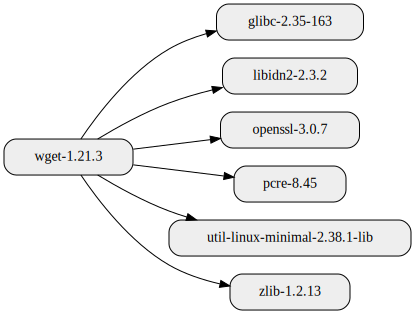
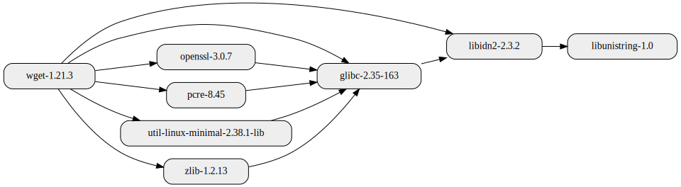
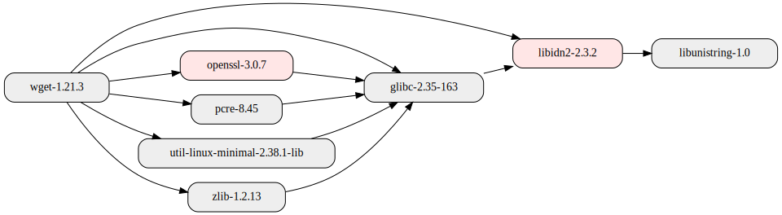
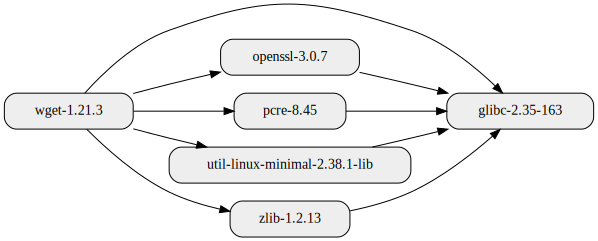
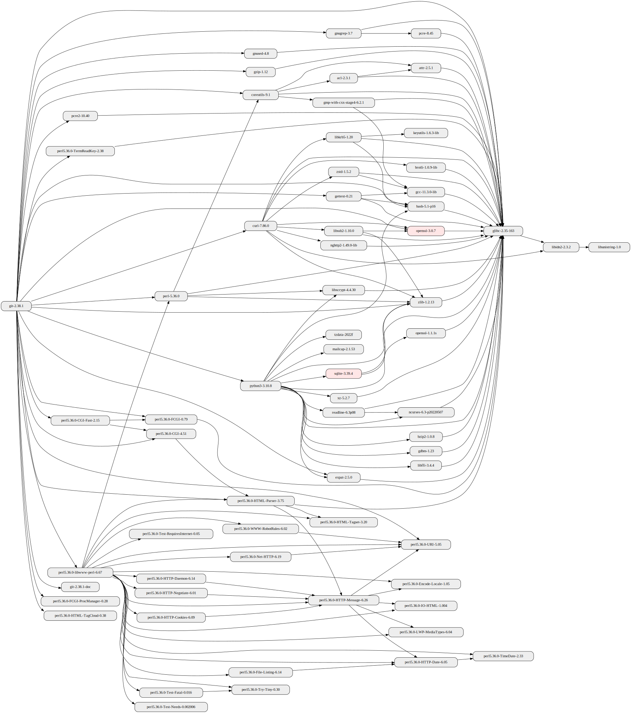
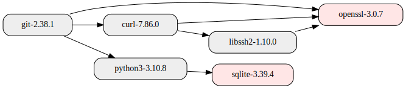
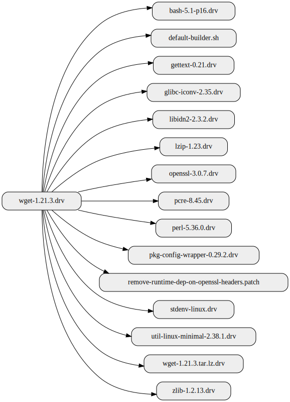
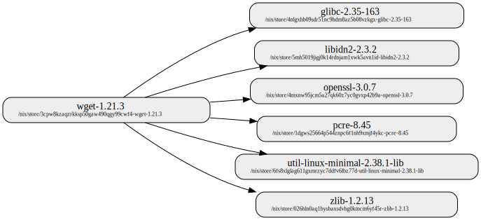

<!--
SPDX-FileCopyrightText: 2022-2023 Technology Innovation Institute (TII)

SPDX-License-Identifier: CC-BY-SA-4.0
-->

# nixgraph

[`nixgraph`](../src/nixgraph/main.py) is a python library and command line utility for querying and visualizing dependency graphs for [Nix](https://nixos.org/) packages.


Table of Contents
=================
* [Getting Started](#getting-started)
* [Usage examples](#usage-examples)
   * [Example: package runtime dependencies](#example-package-runtime-dependencies)
   * [Example: depth](#example-depth)
   * [Example: colorize](#example-colorize)
   * [Example: inverse](#example-inverse)
   * [Example: package buildtime dependencies](#example-package-buildtime-dependencies)
   * [Example: output format](#example-output-format)
   * [Example: pathnames](#example-pathnames)


## Getting Started
To get started, follow the [Getting Started](../README.md#getting-started) section from the main [README](../README.md).

As an example, to run the [`nixgraph`](../src/nixgraph/main.py) from your local clone of the `tiiuae/sbomnix` repository:
```bash
# '--' signifies the end of argument list for `nix`.
# '--help' is the first argument to `repology_cli`
$ nix run .#nixgraph -- --help
```

## Usage examples
In the below examples, we use nix package `wget` as an example target.
To print `wget` out-path on your local system, try something like:
```bash
$ nix eval -f '<nixpkgs>' 'wget.outPath'
"/nix/store/8nbv1drmvh588pwiwsxa47iprzlgwx6j-wget-1.21.3"
```

#### Example: package runtime dependencies
```bash
$ nixgraph /nix/store/8nbv1drmvh588pwiwsxa47iprzlgwx6j-wget-1.21.3

INFO     Loading runtime dependencies referenced by '/nix/store/8nbv1drmvh588pwiwsxa47iprzlgwx6j-wget-1.21.3'
INFO     Wrote: graph.png
```
By default `nixgraph` scans the given target and generates a graph that shows the direct runtime dependencies.
The default output is a png image `graph.png`:


<br /><br />


#### Example: depth
```bash
$ nixgraph /nix/store/8nbv1drmvh588pwiwsxa47iprzlgwx6j-wget-1.21.3 --depth=2
```

By default, when `--depth` argument is not specified, `nixgraph` shows the direct dependencies. Increasing the `--depth` makes `nixgraph` walk the dependency chain deeper. For instance, with `--depth=2`, the output graph for `wget` becomes: 


<br /><br />

The value of `--depth` indicates the maximum depth between any two nodes in the resulting graph. For instance, in the above example, `libunistring-1.0` gets included with `--depth=2` because the shortest path between `wget` and `libunistring` is two hops deep (`wget --> libidn2 --> libunistring`). 

#### Example: colorize
```bash
$ nixgraph /nix/store/8nbv1drmvh588pwiwsxa47iprzlgwx6j-wget-1.21.3 --depth=2 --colorize='openssl|libidn'
```

`--colorize` allows highlighting nodes that match the specified regular expression:


<br /><br />


#### Example: inverse
```bash
$ nixgraph /nix/store/8nbv1drmvh588pwiwsxa47iprzlgwx6j-wget-1.21.3 --depth=2 --inverse='glibc'
```

`--inverse` makes it possible to draw the graph backwards starting from nodes that match the specified regular expression. For instance, the above command would show all the dependency paths from `wget` that lead to `glibc`:


<br /><br />

`--inverse` is especially useful when working with larger graphs. 

As an example, consider the following graph for `git`:
(`nixgraph /nix/store/sb0fay7ihrqibk325qyx0377ywrfdnxp-git-2.38.1 --depth=3 --colorize="openssl-3|sqlite-3"`)


<br /><br />

To find out what are all the runtime dependency paths from `git` to the highlighted nodes `openssl` or `sqlite` in the above graph, run the following command:
```bash
# --depth=100: make sure the output graph includes "long enough" dependency chains
# --inverse="openssl-3|sqlite-3": draw the graph backwards starting from nodes that
#                                 match the specified reqular expression
# --colorize="openssl-3|sqlite-3": colorize the matching nodes
nixgraph /nix/store/sb0fay7ihrqibk325qyx0377ywrfdnxp-git-2.38.1 --depth=100 --colorize="openssl-3|sqlite-3" --inverse="openssl-3|sqlite-3"
```
The output now becomes:


<br /><br />

The output graph shows that there are three dependency paths from `git` to `openssl-3.0.7` and one dependency path that leads to `sqlite-3.39.4`.

#### Example: package buildtime dependencies
```bash
$ nixgraph /nix/store/8nbv1drmvh588pwiwsxa47iprzlgwx6j-wget-1.21.3 --buildtime
```

Specifying `--buildtime` makes `nixgraph` visualize the buildtime dependencies instead of runtime dependencies:


<br /><br />


#### Example: output format
```bash
$ nixgraph /nix/store/8nbv1drmvh588pwiwsxa47iprzlgwx6j-wget-1.21.3 --out="graph.dot"
```
By default `nixgraph` outputs the graph in png image `graph.png`. To change the output file name and format, use the `--out` argument. The output filename extension determines the output format.  As an example, the above command would output the graph in `dot` format. For a full list of supported output formats, see: https://graphviz.org/doc/info/output.html. In addition to graphviz supported output formats, the tool supports output in csv to allow post-processing the output data.


#### Example: pathnames
```bash
$ nixgraph /nix/store/8nbv1drmvh588pwiwsxa47iprzlgwx6j-wget-1.21.3 --depth=1 --pathnames
```

`--pathnames` argument allows adding store path to node label in the output graph:


<br /><br />
